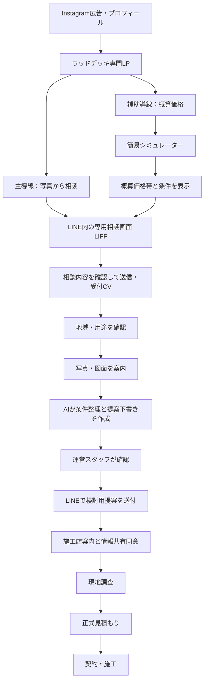

# plus wood deck｜CV導線・LINE相談・AI提案 統合企画設計書

作成日：2026-09-21／接続方式更新：2026-09-22  
対象：Instagram広告 → LP／概算価格 → LINE相談 → 提案 → 現地調査 → 正式見積もり → 受注  
状態：企画・実装基準版。未実装機能を公開LPで提供済みとは表示しない。

## 1. 結論

採用する設計は、**「入口は2つ、相談は1つ」**。

- 主導線：庭の写真から、自宅に合うウッドデッキ案を相談する
- 補助導線：少ない入力で概算価格を確認してから相談する
- 合流点：LINE内の専用相談画面（LIFF）
- 広告CV：LINE友だち追加ではなく、利用者が相談内容を確認して送信し、相談APIの受付記録が残った時点
- 品質評価：有効相談、写真受領、現地調査、見積もり、受注、案件利益まで追う

AIそのものを売りにせず、ユーザーが得られる結果を訴求する。

> 庭の写真から、わが家に合うデッキ案を。

AIが作る画像は「完成予想図」「施工図」と呼ばず、**検討用プランイメージ**と明記する。設置可否、構造、納まり、排水、境界、正式価格は地域の施工対応店が現地確認後に判断する。

### 2026-09-22に確認できたLINE構成

- plusウッドデッキのMessaging APIは利用中。
- Webhook URLはUTAGEの受信URLに設定済み。
- カーポート側はUTAGEにMessaging APIチャネルとLINE Loginチャネルを登録して運用する構成。
- ウッドデッキ側のLINE Loginチャネルは、今回の資料だけでは確認できていない。

したがって、**plusウッドデッキのWebhook URLを自社ボット用URLへ変更しない**。初期方式はカーポート側とそろえ、UTAGEを維持したままLIFFと専用相談APIで受付・写真提出・案件管理を行う。

## 2. 事業上の目的とCV定義

### 最上位の目的

広告やLINE登録を増やすことではなく、対応可能な相談を現地調査・見積もり・受注へ進め、案件利益を残すこと。

### 指標の階層

| 区分 | 指標 | 定義 |
| --- | --- | --- |
| 広告CV | 相談受付 | 利用者がLINE内の専用相談画面で内容を確認して送信し、相談APIが案件を受け付けた時点。自動挨拶・友だち追加だけは含めない |
| 品質KPI | 有効相談 | 対応地域、戸建て所有／新築予定、検討意思、相談内容を確認できた案件 |
| 行動KPI | 写真・図面受領 | 提案判断に使える敷地写真または図面を1点以上受領 |
| 商談KPI | 現地調査予約 | 日時または調整開始を記録 |
| 営業KPI | 正式見積もり | 施工対応店が正式見積もりを提出 |
| 事業KPI | 受注・案件利益 | 受注金額、紹介料等の収益、広告費、運用費を踏まえて確定 |

友だち追加数とCTAクリック数は診断用の中間指標とし、主CVにはしない。

## 3. 全体の顧客体験



### 重要な設計判断

1. 最初から写真・図面を必須にしない。
2. 最初の送信は「市区町村＋庭でしたいこと」だけでも成立させる。
3. 価格診断で入力済みの情報をLINEで再入力させない。
4. AI提案をそのまま自動送信せず、初期運用では人が確認する。
5. 施工対応店へ個人情報を共有する前に、共有先・項目・目的を示して同意を得る。

## 4. LP企画

### LPで伝える一つの約束

> 庭でしたいことと自宅の条件から、形・サイズ・素材・費用の考え方を整理できる。

### ファーストビューの公開後コピー

ボットと提案体制の稼働確認後に、次へ切り替える。

**小見出し**

> 家と庭に合わせる、ウッドデッキ専門店

**メインコピー**

> 庭の写真から、  
> わが家に合うデッキ案を。

**サブコピー**

> サイズが決まっていなくても大丈夫。  
> 庭でしたいことと写真から、形・広さ・素材・費用の考え方を整理します。

**主CTA**

> 庭の写真からデッキ案を相談する

**CTA補足**

> 写真はあとからでもOK。まずは市区町村と、庭でしたいことをひとこと。

**補助リンク**

> まずは概算価格を見てみる

「AIで作成」「即時提案」「無料」「30秒」は、実際の運用・所要時間・料金条件が確定するまで主見出しに使わない。

### 上部約1,400pxの情報順

1. 住宅・窓・庭・デッキが分かる完成イメージ
2. 上記の価値提案と主CTA
3. 「写真を送る → 条件を整理 → デッキ案を受け取る」の3ステップ
4. 届く提案のサンプル1件
5. サイズ別の用途例と費用を左右する条件
6. 補助リンク「概算価格を見る」

既存の暮らし紹介、サイズ図、6種類のプランイメージは残す。ただし、新しい主価値である「相談後に何が届くか」を、暮らし紹介より前に短く見せる。

### 提案サンプルの見せ方

1画面内に次の4点をまとめる。

- 自宅写真
- 写真に合わせた検討用プランイメージ
- 推奨形状の短い説明
- 「現地で確認する点」2〜3項目

ラベル：

> 検討用プランイメージ  
> 実際の設置可否・仕様・色・寸法とは異なる場合があります。

実顧客の写真を使う場合は、広告掲載と画像加工について書面等で利用許諾を取得する。

## 5. 概算価格シミュレーター

### 役割

見積もりを完成させる場所ではなく、価格への不安を軽くしてLINE相談へつなぐ場所。

### 最初に聞く項目

1. 希望用途：ひと休み／洗濯／2人でお茶／家族で食事／まだ未定
2. おおよその幅
3. おおよその奥行き
4. 設置地域

商品、色、床高、地面、撤去、ステップ、目隠し、屋根などは、概算表示後またはLINE内で確認する。

### 結果画面

- 選択条件
- 根拠を確認できる概算価格帯
- 含むもの／含まない可能性があるもの
- 金額が変わる代表条件
- CTA「この条件で設置できるか、写真で確認する」

価格マスターに確認済み情報がない場合は金額を生成せず、「費用を左右する条件」の表示に留める。

「正確な本体価格」「施工込み○円」といった表現は、表示額の範囲と内訳が一致する場合だけ使用する。正式金額は現地確認後の見積もりであることを明示する。

## 6. LP・シミュレーターからLINEへの引き継ぎ

### 推奨方式

**UTAGEのWebhookを維持し、LIFFと専用相談APIで引き継ぐ方式を採用する。**

1. CTAを押す直前に、サーバーで個人情報を含まない相談下書きを作成する。
2. 高エントロピーの短期引き継ぎトークンを発行する。
3. plusウッドデッキ専用のLIFFを開く。
4. LINE Loginで本人を認証し、トークンを1回だけ使用して下書きを本人へ関連付ける。
5. 利用者が市区町村・希望用途・利用目的を確認して「この内容で相談する」を押す。
6. 相談APIが案件を保存できた時点で `inquiry_created` を1回記録する。
7. UTAGEのメッセージまたはリッチメニューから、同じ相談画面を再開できるようにする。

```text
consultation_id: 内部UUID
public_code: WD-A7K29P
source: instagram / lp / simulator
campaign: UTM等
selected_plan: angled など
selected_size: pair など
intent: dining など
price_condition_id: シミュレーター結果ID
expires_at: 有効期限
```

引き継ぎトークンはサーバーではハッシュ化し、短時間で失効させる。認証・関連付け後はURLから除く。URL、UTM、アクセスログ、dataLayerへ氏名・住所・LINE user ID・写真URLなどの個人情報を含めない。

LIFF上では、LPまたは価格シミュレーターの選択内容を確認できる状態で開始する。

```text
ウッドデッキを相談したいです。
希望：家族で食事
参考にした形：敷地に沿う変形デッキ
施工希望地域：［市区町村を入力］
```

利用者が明示的に送信するまでは案件受付としない。途中保存は `draft`、送信成功後は `inquiry` とする。

### フォールバック

LIFFを利用できない環境では、LINE公式のURLスキームで相談コードを入力済みのトーク画面を開く。現行LPの基礎実装をフォールバックとして残す。ただし、UTAGEから意味のあるメッセージ受信を外部システムへ確実に通知できることが確認できるまで、メッセージ受信をCVの正本にはしない。

### UTAGE連携の境界

- UTAGE：友だち管理、挨拶、配信、リッチメニュー、有人チャット
- LIFF／相談API：相談受付、回答、写真・図面、提案、同意、案件状態、CVの正本
- AI処理：相談APIに保存された案件だけを対象に実行

UTAGEが受信メッセージ・画像・タグ付与・シナリオ到達を外部へ安全に通知できる場合は、後から連携を追加できる。仕様確認前にUTAGEのWebhook URLを変更したり、同じMessaging APIチャネルへ別のWebhook受信先を設定したりしない。

## 7. LINE内相談画面・UTAGE会話設計

### 会話の原則

- 相談画面では1画面1テーマ、質問は1つずつ表示
- 選択式で答えられる内容はボタン、自由入力が必要なものだけキーボード入力
- 写真・図面はLIFFの専用アップロード画面で提出
- 「あとで送る」「スタッフに相談」を常に用意
- 回答済みの内容を再質問しない
- 不明点をAIが推測で埋めない

UTAGEのリッチメニューとメッセージには、`相談を始める`、`写真・図面を送る`、`提案を見る`、`スタッフに相談`を配置し、各ボタンから認証済みのLIFF画面を開く。

### 初回会話

**利用者がLIFFで確認する内容**

> ウッドデッキを相談したいです。  
> 施工希望地域：福岡市

「この内容で相談する」を押し、相談APIの保存が成功した時点で `inquiry_created` を記録する。既に同じ案件で受付済みなら重複計上しない。

**受付後のUTAGE案内1**

> ご相談ありがとうございます。  
> 商品名やサイズが決まっていなくても大丈夫です。まず、庭で一番したいことを教えてください。

選択肢：

- 家族で食事
- 子どもの遊び場
- 洗濯・物干し
- 庭への出入り
- まだ決まっていない

**相談画面またはUTAGE案内2**

> 次に、お庭の写真があると、家とのつながりや置けそうな形を整理しやすくなります。撮れる範囲で大丈夫です。

案内する写真：

1. リビングの窓と庭が一緒に写る正面
2. 庭の右側
3. 庭の左側
4. 段差・室外機・立水栓など気になる場所

操作：`写真・図面を送る`／`あとで送る`／`スタッフに相談`

**任意確認**

- 図面の有無
- 分かる範囲の幅・奥行き
- 希望予算
- 希望時期
- 戸建て所有／新築予定

### 状態管理

| 状態 | 意味 | 次の動作 |
| --- | --- | --- |
| `draft` | 個人情報を含まない相談下書き作成済み | LIFF認証と送信を待つ |
| `inquiry` | 相談APIが明示的な送信を受け付け、広告CV成立 | 地域・用途を確認 |
| `qualified` | 一次条件を確認 | 写真を案内 |
| `assets_partial` | 写真不足 | 不足する撮影方向だけ案内 |
| `assets_ready` | 提案可能な素材あり | AI解析へ送る |
| `needs_info` | 判断材料不足 | 1問ずつ追加確認 |
| `ai_draft_ready` | AI下書き作成済み | スタッフ確認 |
| `review_required` | 人の判断待ち | 修正・承認 |
| `proposal_sent` | 検討用提案送信済み | 現地調査意向を確認 |
| `consent_pending` | 施工店共有前 | 共有先・項目・目的を提示 |
| `referred` | 同意後に施工店へ連携 | 日程・進捗を追跡 |
| `site_visit` | 現地調査段階 | 見積もり状況を追跡 |
| `quoted` | 正式見積もり済み | 受注／失注を確認 |
| `won` / `lost` / `hold` | 結果確定 | 利益・理由を記録 |

## 8. AI提案の仕様

### AIが行うこと

1. 写真・図面・回答から、見えている条件と不足情報を抽出
2. 用途に合う形・広さ・素材候補を整理
3. 現地で確認すべき点を列挙
4. 価格マスターがある場合だけ、条件付き概算を組み立て
5. 検討用プランイメージの生成指示を作成
6. LINE送信用の短い提案文を下書き

OpenAIのResponses APIはテキスト、画像、ファイルを入力にできる。画像生成ツールは入力画像を使った生成・編集にも対応するため、写真解析と検討用画像作成を分けて実装できる。画像出力は施工可否の判定には使わない。

### AIに任せないこと

- 構造安全性の確定
- 境界・法規・建築確認等の確定
- 基礎、排水、配管、電気設備の最終判断
- 現地未確認での正式寸法
- マスターにない価格や値引率の生成
- 施工店の保証内容の決定
- 顧客同意なしの施工店への情報共有

### 構造化出力

AIの回答は自由文だけで保存せず、次のJSON構造で受ける。

```json
{
  "observed_conditions": [],
  "unknown_conditions": [],
  "recommended_plan": {
    "shape": "",
    "use_case": "",
    "size_assumption": "",
    "material_candidates": [],
    "option_candidates": []
  },
  "price": {
    "status": "unavailable|range_available",
    "range": null,
    "included": [],
    "excluded_or_unknown": []
  },
  "site_check_items": [],
  "risk_flags": [],
  "follow_up_question": null,
  "customer_summary": ""
}
```

`risk_flags` が1件でもある、画像が不鮮明、境界や設備が不明、価格条件が不足している場合は自動送信しない。

### 提案書の表示順

1. ご希望の整理
2. おすすめの形
3. 広さの考え方
4. 素材・オプション候補
5. 概算価格帯または価格を確認するために必要な条件
6. 検討用プランイメージ
7. 現地で確認する点
8. CTA「現地で設置できるか確認したい」

### 画像の表示ラベル

> AIを利用した検討用プランイメージです。  
> 実際の設置可否、寸法、色、素材、納まり、価格を示すものではありません。

## 9. システム構成

### 推奨構成

- 既存LP：GitHub Pagesの静的サイトを継続
- 概算価格：既存PlusエクステリアのVercelアプリを利用・改修
- LINE配信・チャット：現在のUTAGE連携を維持
- LINE内相談画面：plusウッドデッキ専用のLINE LoginチャネルとLIFFを追加
- 相談バックエンド：Vercel等のHTTPS環境に相談APIを構築。LINE Messaging APIのWebhook受信先にはしない
- データベース：相談・回答・状態・同意・施工店連携を保存するRDB
- ファイル保存：期限・権限を管理できる非公開オブジェクトストレージ
- AI：画像理解・構造化提案と画像生成を別工程で呼び出す
- 運営画面：スタッフの確認、修正、承認、施工店振り分け、進捗管理

### 処理の流れ

1. LP／シミュレーターが相談セッションを作成
2. 短期引き継ぎトークン付きでLIFFを開く
3. LINE LoginのIDトークンをサーバー側で検証し、下書きを本人へ関連付ける
4. 利用者が明示的に相談を送信し、相談APIが案件と `inquiry_created` を保存する
5. 写真・図面をLIFFから非公開ストレージへ直接アップロードする
6. 不足項目を相談画面またはUTAGEの案内で確認する
7. AIが構造化下書きと検討用画像を生成する
8. スタッフが運営画面で確認・修正・承認する
9. UTAGEのメッセージから提案画面へ案内する
10. 顧客同意後に施工対応店へ必要情報だけを共有する

### LIFFの用途

LIFFは初期版から次の用途に使う。

- 複数写真・図面の整理アップロード
- 入力済み内容の確認・修正
- 提案一覧
- 現地調査の日程候補
- 施工店への共有同意

LINE外ブラウザからLIFFを開く場合も、LINE公式の `liff.login()` を利用する。LINE LoginとMessaging APIのチャネルは同じProvider配下で正しく関連付ける。

### 代替方式を採用できる条件

UTAGEが、受信した本文・画像・ユーザー識別子・タグ／シナリオ到達を外部APIへ安全かつ再送可能な形で渡せることが確認できた場合は、トークルームへ直接送られた写真も自動処理へ追加する。その場合もUTAGEのWebhookを維持し、受信イベントの重複排除・本人との関連付け・削除依頼への対応を設計する。

## 10. データ設計

### 主要テーブル

| テーブル | 主な内容 |
| --- | --- |
| `consultations` | 相談ID、公開コード、流入、状態、地域、用途、担当者 |
| `consultation_events` | イベント名、日時、広告属性、画面位置 |
| `answers` | 質問ID、回答、回答元、更新履歴 |
| `assets` | 写真・図面種別、保存先、同意範囲、削除予定日 |
| `price_sessions` | シミュレーター条件、価格マスター版、表示結果 |
| `proposals` | AI下書き、スタッフ修正、承認者、送付版 |
| `consent_records` | 共有先、共有項目、目的、同意文、日時、方法 |
| `partner_assignments` | 施工店、対応可否、割当理由、引継ぎ状況 |
| `status_history` | 状態変更、担当者、理由 |
| `outcomes` | 現地調査、見積額、受注額、利益、失注理由 |

### データ保護

- URL、dataLayer、広告パラメータに個人情報を入れない
- LINEチャネルシークレット、アクセストークン、OpenAI APIキーは環境変数で管理
- 写真・図面は非公開保存し、署名付きURL等で期限付き表示
- スタッフの閲覧権限を役割で分離
- 同意前は施工店へ共有しない
- 保存期間・削除方法・利用目的をプライバシーポリシーと運用に合わせる
- ログへメッセージ本文や画像URLを無制限に残さない

## 11. イベント計測

| イベント | 発生条件 |
| --- | --- |
| `lp_view` | LP表示 |
| `proposal_cta_click` | 写真相談CTA押下 |
| `price_start` | シミュレーター開始 |
| `price_result_view` | 概算結果表示 |
| `liff_open` | LINE内専用相談画面の表示 |
| `handoff_claimed` | 下書きと認証済みLINE利用者の関連付け成功 |
| `inquiry_created` | 利用者が相談を明示的に送信し、相談APIが案件を受け付けた。広告CV |
| `qualified_lead` | 有効相談条件を満たす |
| `asset_received` | 写真または図面受領 |
| `proposal_reviewed` | スタッフ承認 |
| `proposal_sent` | 提案送付 |
| `partner_consent` | 施工店共有への同意取得 |
| `site_visit_booked` | 現地調査予約 |
| `quote_submitted` | 正式見積もり提出 |
| `order_won` | 受注 |
| `project_profit_confirmed` | 案件利益確定 |

相談IDで広告、LP選択、価格条件、LINE会話、施工結果を連結する。電話番号や氏名で広告データを結合しない。

### 初期の診断順

1. LP → CTAクリック率
2. CTAクリック → LIFF表示率
3. LIFF表示 → 相談受付率
4. 相談受付 → 有効相談率
5. 有効相談 → 写真受領率
6. 写真受領 → 提案送付率・所要時間
7. 提案送付 → 現地調査率
8. 現地調査 → 見積もり率
9. 見積もり → 受注率・利益

CV数が増えても、有効相談率や現地調査率が下がる場合は改善と判定しない。

## 12. 運営と施工店連携

### 運営窓口

- 広告・LP・LINEの運営
- 相談内容の整理
- AI下書きの確認
- 対応地域と施工内容の一次判定
- 施工対応店の案内
- 情報共有同意の取得
- 案件進捗の回収

### 施工対応店

- 現地調査
- 正式な設置可否判断
- 商品・仕様・価格の説明
- 見積もり、契約、施工
- 保証・アフターサービス

### 振り分け条件

- 対応地域
- 取扱商品・素材
- 屋根・目隠し・撤去等への対応可否
- 稼働状況
- 返信期限の遵守状況
- 苦情・事故・見積もり辞退の履歴

自動振り分けは候補提示まで。個人情報の共有は同意取得後に実行する。

## 13. 実装フェーズ

### Phase 0｜運用データの確定

- 公開済み画像に写ったLINE認証情報の再発行とUTAGE再設定
- plusウッドデッキのLINE Developers Providerと管理権限を確認
- 同じProvider内にplusウッドデッキ用LINE Loginチャネルを作成または既存有無を確認
- LIFFとMessaging APIチャネルの関連付け
- UTAGEで利用する挨拶・リッチメニュー・再開導線の確認
- 対応地域
- 施工店マスター
- 価格・商品・施工条件マスター
- 写真・図面の保存期間
- 提案確認担当者と返信運用

### Phase 1｜問い合わせを確実に受けるMVP

- 相談ID発行
- LP／シミュレーターからLIFFへの安全な引き継ぎ
- LINE Login認証と下書きの本人関連付け
- 相談APIによる `inquiry_created` の一意記録
- LIFFでの地域・用途・写真収集
- UTAGEから相談画面を再開する導線
- スタッフ引継ぎ
- 案件ステータス管理

この段階では、人が提案を作成してもよい。まず相談データを欠損なく取得する。

### Phase 2｜AIによる条件整理

- 写真・図面の読み取り
- 不足情報の抽出
- 構造化された提案下書き
- スタッフ確認画面
- 提案テンプレート

### Phase 3｜検討用画像

- 入力写真を参照した画像生成
- 画像ラベルと注意事項
- 人による承認
- LINEへの画像送付

### Phase 4｜施工店連携と最適化

- 施工店候補の自動提示
- 電子的な共有同意
- 現地調査予約
- 見積もり・受注・利益の回収
- 広告／地域／施工店別の改善

## 14. 公開判定

次を満たすまで、LPの主CTAを「写真からデッキ案」に切り替えない。

- LINE公式アカウントが本番接続済み
- UTAGEのWebhookを維持したまま挨拶・配信・有人チャットが動作する
- LIFFで本人認証し、相談下書きを安全に引き継げる
- 相談受付を重複なく記録できる
- 写真・図面を安全に保存できる
- AI提案をスタッフが確認できる
- 提案画像に注意表示が付く
- スタッフ不在・AI失敗時の代替対応がある
- 施工店共有の同意記録が残る
- プライバシーポリシーと利用案内が実運用に合っている

## 15. テスト項目

- Instagramアプリ内ブラウザからLINEが開く
- Instagramアプリ内ブラウザ、LINE内ブラウザ、Safari／ChromeからLIFF認証を完了できる
- iPhone／Androidで相談下書きが欠損しない
- 引き継ぎトークンの期限切れ・再利用・別ユーザー利用を拒否できる
- 同じ送信操作が再実行されても相談を二重登録しない
- UTAGEの既存Webhook URLが変更されていない
- 大きい画像、HEIC、PDF、複数写真を扱える
- 不鮮明な写真から断定しない
- 対応地域外を正しく案内する
- 写真を「あとで送る」でも相談を止めない
- AI停止時にスタッフ対応へ切り替わる
- 同意前に施工店へ情報が渡らない
- ブロック・配信停止・削除依頼を処理できる

## 16. 実装開始に必要なもの

1. LINE公式アカウントのBasic IDまたはPremium ID
2. LINE DevelopersのProvider／Messaging APIチャネルを確認できる管理権限
3. plusウッドデッキ用LINE Loginチャネルの作成・確認とLIFF登録権限
4. PlusエクステリアのGitHub／Vercelプロジェクト
5. UTAGEのシナリオ、リッチメニュー、外部連携機能を確認できる権限
6. 商品・価格・工事条件の確認済みデータ
7. 対応地域と施工店マスター
8. 提案を確認する担当者と運用時間
9. 保存期間、削除依頼、第三者提供同意の運用方針
10. OpenAI APIを利用するプロジェクトとAPIキー設定環境

Channel secret、LINE Loginのチャネルシークレット、アクセストークン、OpenAI APIキーそのものは、チャット、設計書、GitHubへ貼らない。実装時はVercel等の暗号化された環境変数へ設定する。

## 17. 今回共有された認証情報への対応

今回のスクリーンショットには、plusウッドデッキのMessaging API Channel secretと、カーポート側のMessaging API／LINE Loginのチャネルシークレットが表示されている。共有範囲を限定していても、画像から読み取れる認証情報は漏えい済みとして扱う。

1. LINE Developers Consoleで該当するチャネルシークレットを再発行する。
2. UTAGE側へ新しい値を設定し、接続確認を行う。
3. 旧シークレットで連携できないことを確認する。
4. 今後のスクリーンショットでは、シークレット、アクセストークン、Webhook固有文字列を塗りつぶす。
5. 認証情報をソースコード、公開GitHub、ログ、分析イベントへ保存しない。

再発行が完了するまで、本番連携の開発・テストに現在の値を使用しない。

## 18. 参照した公式仕様

- [OpenAI：Image generation](https://developers.openai.com/api/docs/guides/tools-image-generation)
- [OpenAI：Responses API](https://developers.openai.com/api/reference/cli/resources/responses/methods/create)
- [LINE：Receive messages (webhook)](https://developers.line.biz/en/docs/messaging-api/receiving-messages)
- [LINE：Use quick replies](https://developers.line.biz/en/docs/messaging-api/using-quick-reply/)
- [LINE：Use LINE features with the LINE URL scheme](https://developers.line.biz/en/docs/messaging-api/using-line-url-scheme/)
- [LINE：LIFF API reference](https://developers.line.biz/en/reference/liff)

本書はサービス・システム・運用の企画設計であり、法務、建設業許可、設計・施工上の専門判断を代替しない。
